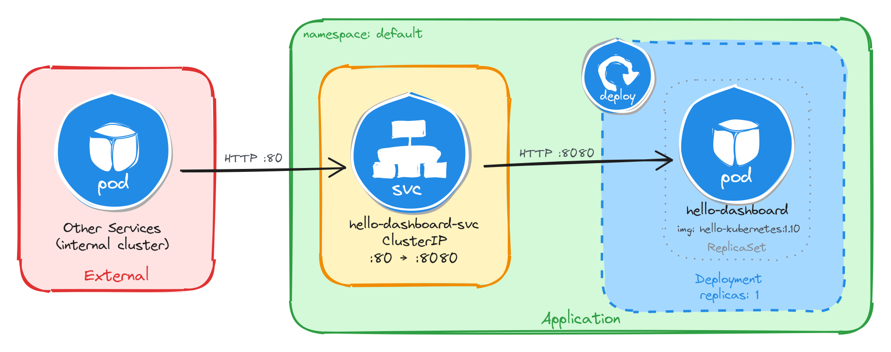
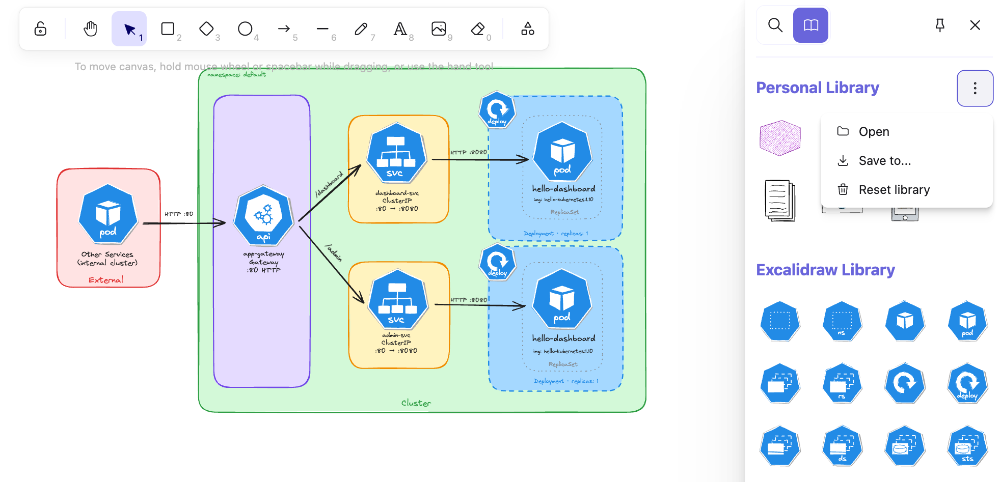
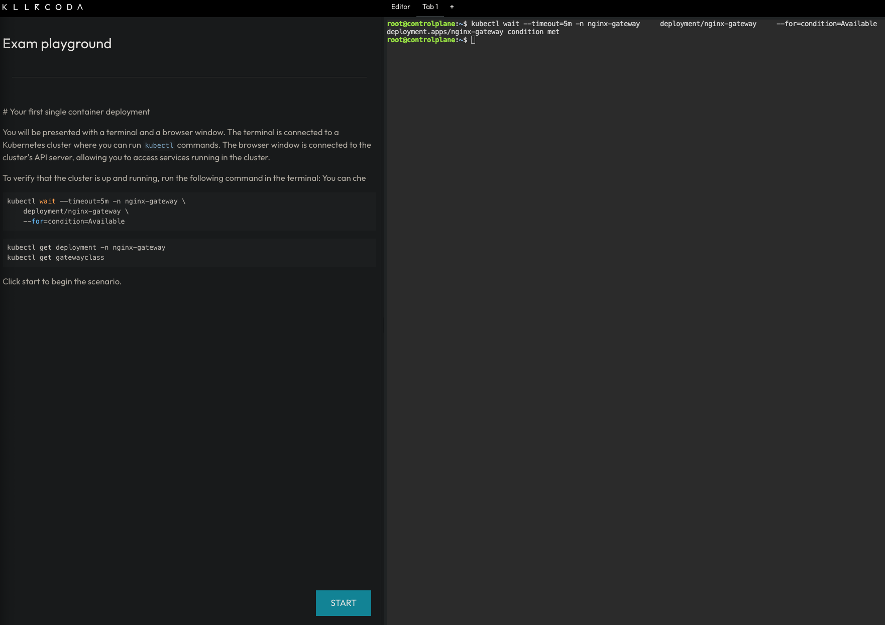
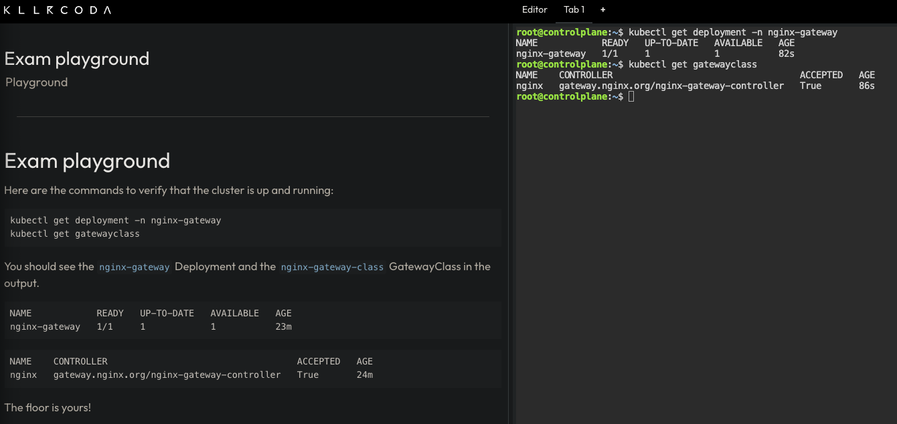

# Introduction (or "*Why we wrote it*")

Welcome to the "Kubernetes System Design in Easy Steps" workbook! We want to begin this book by explaining our motivations to engage in this activity, motivations that arise from two different yet complementary sources. 

The first motivation is stricly related to our teaching: at the beginning of 2026, we were designing the Spring course "*Cloud-native computing*" for the Master's degree in Computer Science at the [University of Salerno](https://web.unisa.it/en/university). The course was re-designed from a previous version (based only on serverless computing) in order to take into account the foundational basis of Cloud-native technology, and therefore supposed to be dealing, in the first half, with the fundamentals of Cloud computing, virtual machines, containerization and serverless computing. The main course of the course (🙂) was supposed to come in the second half and was to be based on Kubernetes, which would include also laboratory activities that had to be engaging, concise, and effective for our master students. 

In our vision, the laboratory exercises were to be hands-on and practical but, nevertheless, grounded into a system-wide, abstract view of what we were proposing to use Kubernetes for. Something that would provide the necessary competence to effectively use Kubernetes in a "real", although simulated, environment, without loosing a broader, design-oriented, view, where every techological choice, configuration, deployment, etc. was explicitly linked to an explicit requirement of the given problem. 

The second motivation was more general, as we recognized that we were not able to find teaching material that was structured around the principles we wanted to base out teaching, i.e., a system-design approach, rather than (only) the technical details. We looked in relevant literature considering  technical documentation, academic papers, books and blogs, but, as nothing satisfactory was found, we recognize that we had to undertake this endeavour. 

The motivation here was that this book could be helpful not only for students in a teaching environment but also to professionals that are training themselves into Kubernetes, probably, adopting a more mature, experienced system-oriented approach to the technology. For them, having the technological choice, and technicalities, strongly anchored to a design view meant to answer to a problem, was probably a better way to relate to a new topic to learn.

In a sense, those two motivations were complementary, two sides of the same coin: on one side, young and inexperienced master students that want to know more about Cloud-Native, and on the other side, professionals with significative experience, that were trying to embed into their knowledge this technological valuable asset of current computational landscape, i.e. Kubernetes. And, from here, the decision was made: "*We are going to do it!*" and here we are, we made it!

## An open book (or "*How we wrote it*")

We are strongly committed to contributing to the field using the paradygm of Open Science. As a consequence, our book is not only a static collection of our knowledge, thoughts and experiences but is shaped as a live, open artifact (through GitHub, see more info below) where it is possible to contribute to the next versions. The book will be released under XXX public licens (`TODO`) and will be freely available.

The book will also be released  on Zenodo open repository in PDF twice a year, but the most updated version can be found on GitHub repository, updated daily. 

Contributions are welcomed, again, both as new topics and new tasks, and comments, feedback, questions can be provided on GitHub repository or through email: K8s-system-design.list@unisa.it 

## Learning objectives

Test sequence xx YYYYYY Lorem ipsum dolor sit amet, consectetur adipiscing elit. Pellentesque laoreet tortor nec eros mollis aliquam id eu libero. Aenean ac elit ex. Sed sit amet sagittis erat. Donec ornare arcu sed eros pharetra finibus. Fusce pharetra lacus iaculis, volutpat felis vel, tristique diam. Sed a leo vestibulum, rutrum libero quis, dapibus ex. Ut venenatis felis et facilisis blandit. Sed eu porttitor tellus. Maecenas feugiat congue malesuada. Phasellus in sem lectus. Proin commodo lobortis nibh, sed blandit metus venenatis in. Etiam sit amet lacus eget metus egestas congue vitae eu dolor. Integer ultrices malesuada nulla sed sollicitudin. Mauris commodo nulla mauris, sed luctus nulla posuere sit amet. Mauris sodales nisl lacus, et pretium erat sollicitudin ac.

## Tools

### Excalidraw

Throughout this course, we will design and visualize many Kubernetes architectures before implementing them, and [Excalidraw](https://excalidraw.com) is the tool we chose for the job. It is an open-source virtual whiteboard that produces clean, hand-drawn-style sketches and runs entirely in the browser with no installation required.

However, if you prefer to work inside your editor, Excalidraw is also available as an extension for the most popular IDEs:
- VS Code: [Excalidraw Editor](https://marketplace.visualstudio.com/items?itemName=pomdtr.excalidraw-editor) on the Visual Studio Marketplace.
- JetBrains IDEs (IntelliJ, WebStorm, GoLand, CLion, etc.): [Excalidraw Integration](https://plugins.jetbrains.com/plugin/17096-excalidraw-integration/) on the JetBrains Marketplace.

We use Excalidraw to design and visualize Kubernetes architectures before implementing them. Each chapter includes the source `.excalidraw` file alongside the exported PNG.

As an example, here is the architecture diagram for a Deployment exposed through a ClusterIP Service, reachable only from inside the cluster:



#### How to install Kubernetes icons in Excalidraw

In your local editor, open any `.excalidraw` file, then click **Open** in the right panel and select the `.excalidrawlib` file you want to import. The library will be added to your asset list, and you can start using the icons in your diagrams right away.

We used the [Kubernetes Icons](https://libraries.excalidraw.com/libraries/boemska-nik/kubernetes-icons.excalidrawlib) library for our diagrams, but feel free to explore other libraries or create your own!

The image below shows the import process in VS Code, but the steps are identical in the browser.

[](images/tutorial_asset.png)

### Killercoda

The best way to learn the tools used in this course is to use them hands-on in a safe, interactive environment with no local setup required. This is why we chose [Killercoda](https://killercoda.com/about) as our playground:

> Killercoda is a platform for learning and practicing skills in a safe and interactive environment. It provides hands-on experience with real-world tools and techniques, allowing users to develop their skills and knowledge in a practical way.

Killercoda offers a wide range of scenarios for various topics and skill levels. For this course specifically, we created a custom playground that includes all the tools and resources needed to complete the tasks. You can access it at [https://killercoda.com/isislab/scenario/exam-playground](https://killercoda.com/isislab/scenario/exam-playground).

#### How to use the Killercoda playground

Navigate to [https://killercoda.com/isislab/scenario/exam-playground](https://killercoda.com/isislab/scenario/exam-playground) and start the scenario. This will provision a Kubernetes cluster and deploy all the resources needed for the tasks.

[](images/tutorial_killercoda_1.png)

Once the setup completes, you will have a personal playground instance with a running Kubernetes cluster and a terminal with all the necessary tools pre-installed. Use this terminal to run `kubectl` commands and interact with the cluster as you work through the tasks.

[](images/tutorial_killercoda_2.png)

### Busybox

[Busybox](https://busybox.net) is a minimal Linux image that bundles many common Unix utilities into a single small executable. It is widely used in container environments where image size matters and a full OS is not needed.

In this course, we use Busybox as a lightweight Pod to run quick diagnostic commands inside the cluster without deploying a full application container. For example, checking network connectivity, resolving DNS, or inspecting environment variables.

To get a feel for it, you can run a Busybox container locally with Docker and explore the tools it provides:

```bash
docker run -it --rm busybox sh
```

This starts an interactive shell inside a Busybox container. From there, you can run commands like `wget`, `ping`, or `env`. These are the same utilities you will use later inside Kubernetes Pods.

## How to contribute via GitHub

We welcome all kinds of contributions: bug fixes, content improvements, and suggestions for new exercises or topics. The project is fully hosted on [GitHub](https://github.com/isislab-unisa/kubernetessystemdesign). See [CONTRIBUTING.md](https://github.com/isislab-unisa/kubernetessystemdesign/blob/main/CONTRIBUTING.md) for setup instructions and the contribution workflow.

### Adding a new topic

Create a Markdown file in the `src` directory and add an entry for it in `SUMMARY.md`.

Chapter, section, and subsection numbering is handled automatically by the preprocessor in `book.toml`. For example, `#` maps to `1.`, `##` to `1.1.`, and `###` to `1.1.1.`.

### Adding a task to an existing topic

Add a new section at the appropriate heading level and follow the format of the existing tasks in that file.

### Adding diagrams

Draw your diagram in Excalidraw and place the source `.excalidraw` file in `src/diagrams`. The build process will export it as a PNG to `src/diagrams_images`, which you can then reference in your Markdown file.
