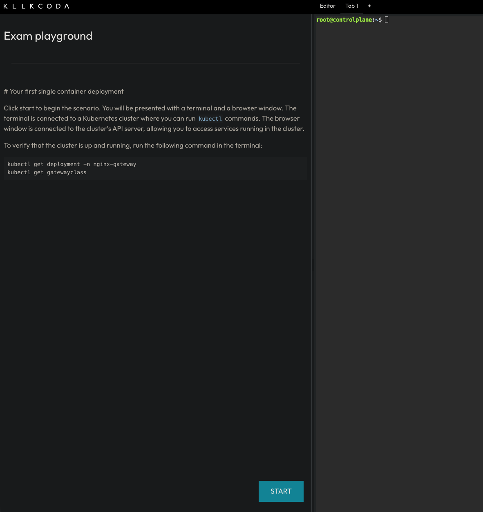
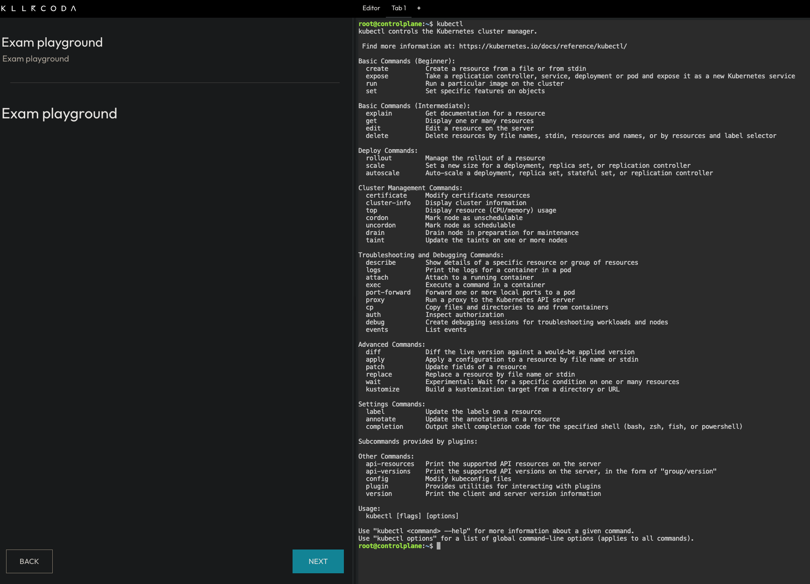
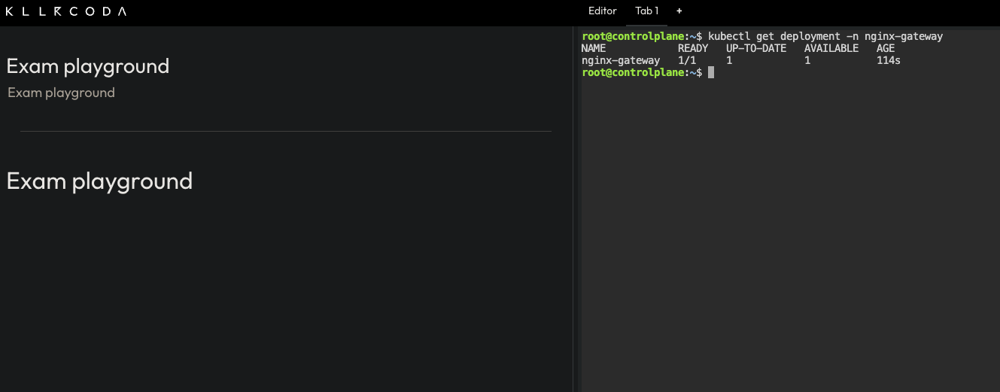

# Introduction

## Learning objectives

Lorem ipsum dolor sit amet, consectetur adipiscing elit. Pellentesque laoreet tortor nec eros mollis aliquam id eu libero. Aenean ac elit ex. Sed sit amet sagittis erat. Donec ornare arcu sed eros pharetra finibus. Fusce pharetra lacus iaculis, volutpat felis vel, tristique diam. Sed a leo vestibulum, rutrum libero quis, dapibus ex. Ut venenatis felis et facilisis blandit. Sed eu porttitor tellus. Maecenas feugiat congue malesuada. Phasellus in sem lectus. Proin commodo lobortis nibh, sed blandit metus venenatis in. Etiam sit amet lacus eget metus egestas congue vitae eu dolor. Integer ultrices malesuada nulla sed sollicitudin. Mauris commodo nulla mauris, sed luctus nulla posuere sit amet. Mauris sodales nisl lacus, et pretium erat sollicitudin ac.

## Tools

### Excalidraw

Throughout this course, we will design and visualize many Kubernetes architectures before implementing them, and [Excalidraw](https://excalidraw.com) is the tool we chose for the job. It is an open-source virtual whiteboard that produces clean, hand-drawn-style sketches and runs entirely in the browser with no installation required.

However, if you prefer to work inside your editor, Excalidraw is also available as an extension for the most popular IDEs:
- VS Code: [Excalidraw Editor](https://marketplace.visualstudio.com/items?itemName=pomdtr.excalidraw-editor) on the Visual Studio Marketplace.
- JetBrains IDEs (IntelliJ, WebStorm, GoLand, CLion, etc.): [Excalidraw Integration](https://plugins.jetbrains.com/plugin/17096-excalidraw-integration/) on the JetBrains Marketplace.

We use Excalidraw to design and visualize Kubernetes architectures before implementing them. Each chapter includes the source `.excalidraw` file alongside the exported PNG.

As an example, here is the architecture diagram for a Deployment exposed through a ClusterIP Service, reachable only from inside the cluster:


#### How to install Kubernetes icons in Excalidraw

On your local editor, open a .excalidraw file, click on the right panel and click Open. Then, select the `.excalidrawlib` file you want to import. The library will be added to your list of assets, and you can start using the icons in your diagrams.
We used this available [asset](https://libraries.excalidraw.com/libraries/boemska-nik/kubernetes-icons.excalidrawlib) for our diagrams, but feel free to explore other libraries or create your own!
You see in the image below how we imported the Kubernetes icons library in Excalidraw in VSCode, but the process is the same in the browser version.
[](images/tutorial_asset.png)

### Killercoda

The best way to learn the tools used in this course is to use them hands-on in a safe, interactive environment with no local setup required. This is why we chose [Killercoda](https://killercoda.com/about) as our playground:

> Killercoda is a platform for learning and practicing skills in a safe and interactive environment. It provides hands-on experience with real-world tools and techniques, allowing users to develop their skills and knowledge in a practical way.

Killercoda offers a wide range of scenarios for various topics and skill levels. For this course specifically, we created a custom playground that includes all the tools and resources needed to complete the exercises. You can access it at [https://killercoda.com/isislab/scenario/exam-playground](https://killercoda.com/isislab/scenario/exam-playground).

#### How to use the Killercoda playground

You go to (https://killercoda.com/isislab/scenario/exam-playground) and click on "Start Scenario".
[](images/tutorial_killercoda_1.png)
This will create a personal instance of the playground for you, which includes a Kubernetes cluster and a terminal with all the necessary tools pre-installed.
[](images/tutorial_killercoda_2.png)
You can use this terminal to run `kubectl` commands and interact with the cluster as you work through the exercises in this course.
[](images/tutorial_killercoda_3.png)

### Busybox

[Busybox](https://busybox.net) is a minimal Linux image that bundles many common Unix utilities into a single small executable. It is widely used in container environments where image size matters and a full OS is not needed.

In this course, we use Busybox as a lightweight Pod to run quick diagnostic commands inside the cluster without deploying a full application container. For example, checking network connectivity, resolving DNS, or inspecting environment variables.

To get a feel for it, you can run a Busybox container locally with Docker and explore the tools it provides:

```bash
docker run -it --rm busybox sh
```

This starts an interactive shell inside a Busybox container. From there, you can run commands like `wget`, `ping`, or `env`. These are the same utilities you will use later inside Kubernetes Pods.

## How to contribute via GitHub

You can follow the instructions in the [CONTRIBUTING.md](CONTRIBUTING.md) file to contribute to this project via GitHub.
We welcome contributions of all kinds, including bug fixes, improvements to the content, and suggestions for new exercises or topics to cover.
